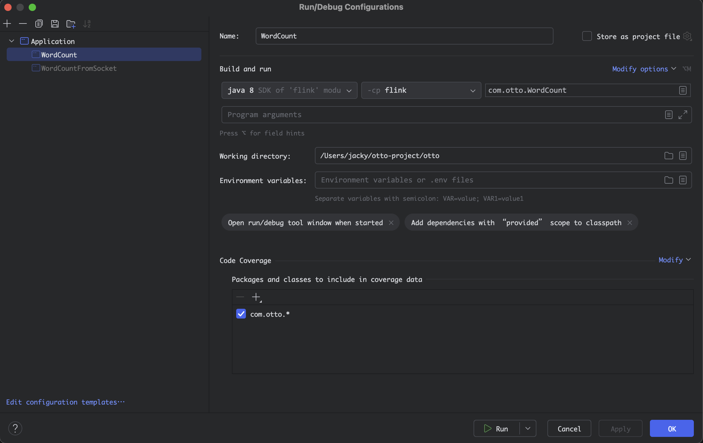
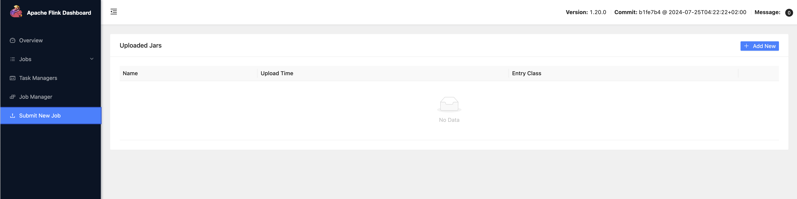
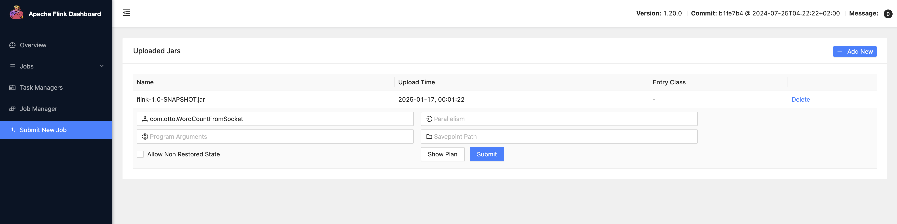
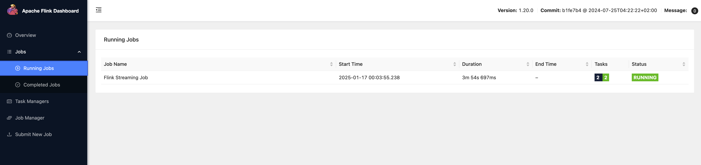
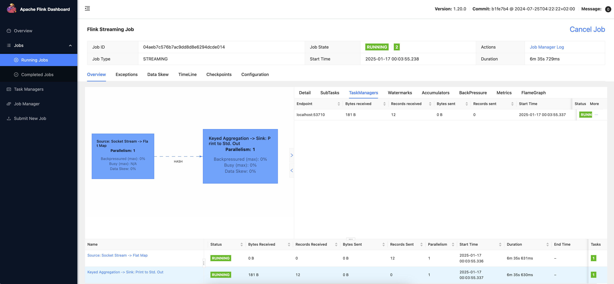
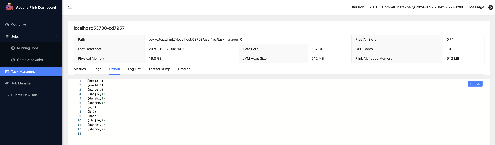

## 单词计数
依赖：
```xml
        <dependency>
            <groupId>org.apache.flink</groupId>
            <artifactId>flink-streaming-java</artifactId>
            <version>1.20.0</version>
        </dependency>

        <dependency>
            <groupId>org.apache.flink</groupId>
            <artifactId>flink-clients</artifactId>
            <version>1.20.0</version>
        </dependency>
```

代码：
```java
import org.apache.flink.api.common.functions.FlatMapFunction;
import org.apache.flink.api.java.tuple.Tuple2;
import org.apache.flink.streaming.api.environment.StreamExecutionEnvironment;
import org.apache.flink.util.Collector;

import java.util.Arrays;

public class WordCount {
    public static void main(String[] args) throws Exception{
        StreamExecutionEnvironment env = StreamExecutionEnvironment.getExecutionEnvironment();

        env.fromData(Arrays.asList("hello world", "nihao shijie", "hello jacky"))
                .flatMap(new FlatMapFunction<String, Tuple2<String, Integer>>() {
                    @Override
                    public void flatMap(String s, Collector<Tuple2<String, Integer>> collector) throws Exception {
                        String[] words = s.split(" ");
                        for (String word : words) {
                            collector.collect(Tuple2.of(word, 1));
                        }
                    }
                })
                .keyBy(item -> item.f0)
                .sum(1)
                .print();

        env.execute("Word Count Example");
    }
}
```

输出：
```
3> (hello,1)
3> (hello,2)
6> (world,1)
3> (shijie,1)
1> (nihao,1)
9> (jacky,1)
```

## 单词计数升级
服务器监听端口 `nc -lk 8080`。服务端监听 `listen 8080` 端口并保持 `keep` 连接，能够通过命令行向连接的客户端发送数据。

代码：
```java
import org.apache.flink.api.common.functions.FlatMapFunction;  
import org.apache.flink.api.java.tuple.Tuple2;  
import org.apache.flink.streaming.api.environment.StreamExecutionEnvironment;  
import org.apache.flink.util.Collector;  
  
public class WordCountFromSocket {  
    public static void main(String[] args) throws Exception{  
        StreamExecutionEnvironment env = StreamExecutionEnvironment.getExecutionEnvironment();  
        env.socketTextStream("localhost", 8080)  
                .flatMap(new FlatMapFunction<String, Tuple2<String, Integer>>() {  
                    @Override  
                    public void flatMap(String s, Collector<Tuple2<String, Integer>> collector) throws Exception {  
                        for (String word : s.split(" ")) {  
                            collector.collect(Tuple2.of(word, 1));  
                        }  
                    }  
                })  
                .keyBy(item -> item.f0)  
                .sum(1)  
                .print();  
        env.execute();  
    }  
}
```

## Flink 集群的角色
`Client` 提交作业，不是运行时和执行程序的一部分。

`JobManager` 调度作业，默认进程为 `org.apache.flink.runtime.entrypoint.StandaloneSessionClusterEntrypoint`。

`TaskManager` 执行作业，连接到 `JobManager` 宣布自己可用，并被分配工作。默认进程为 `org.apache.flink.runtime.taskexecutor.TaskManagerRunner`。

## 提交作业给 Flink 集群
启动服务。
```
./bin/start-cluster.sh
```
`Web` 地址默认为 `http://localhost:8081/#/overview` 默认只有 `localhost` 访问，编辑配置文件 `rest.bin-address` 绑定 `0.0.0.0` 即可。

配置依赖和打包插件，然后打包项目。
```
    <dependencies>
        <dependency>
            <groupId>org.apache.flink</groupId>
            <artifactId>flink-streaming-java</artifactId>
            <version>1.20.0</version>
            <scope>provided</scope>
        </dependency>

        <dependency>
            <groupId>org.apache.flink</groupId>
            <artifactId>flink-clients</artifactId>
            <version>1.20.0</version>
            <scope>provided</scope>
        </dependency>

    </dependencies>
    <build>
        <plugins>
            <plugin>
                <groupId>org.apache.maven.plugins</groupId>
                <artifactId>maven-shade-plugin</artifactId>
                <version>3.1.1</version>
                <executions>
                    <execution>
                        <phase>package</phase>
                        <goals>
                            <goal>shade</goal>
                        </goals>
                        <configuration>
                            <artifactSet>
                                <excludes>
                                    <exclude>com.google.code.findbugs:jsr305</exclude>
                                </excludes>
                            </artifactSet>
                            <filters>
                                <filter>
                                    <!-- Do not copy the signatures in the META-INF folder.
                                    Otherwise, this might cause SecurityExceptions when using the JAR. -->
                                    <artifact>*:*</artifact>
                                    <excludes>
                                        <exclude>META-INF/*.SF</exclude>
                                        <exclude>META-INF/*.DSA</exclude>
                                        <exclude>META-INF/*.RSA</exclude>
                                    </excludes>
                                </filter>
                            </filters>
                            <transformers>
                                <transformer implementation="org.apache.maven.plugins.shade.resource.ManifestResourceTransformer">
                                    <!-- Replace this with the main class of your job -->
                                    <mainClass>my.programs.main.clazz</mainClass>
                                </transformer>
                                <transformer implementation="org.apache.maven.plugins.shade.resource.ServicesResourceTransformer"/>
                            </transformers>
                        </configuration>
                    </execution>
                </executions>
            </plugin>
        </plugins>
    </build>
```

Tips 依赖配置为 provided 之后 idea 运行会提示找不到类，点击下图左下角的 Edit configuration templates，勾选 `Add dependencies with "provided" scope to classpath` 即可在本地运行。


登录 Flink Web，进入提交作业界面，点解 Add New，选择 jar 包。


点击上传的 jar 包，编辑填入入口类，然后点击 Submit 会立即执行入口类代码。可以多次 Submit 不同的入口类。


在 Jobs 界面可以看到提交的作业，以及运行状态，运行在哪个 TaskManager 上。在作业详情界面的左上角可以 Cancel Job。



进入到具体的 TaskManager 之后，可以在 Stdout 看到输出。


也可以使用命令行提交作业，`-d` 表示分离模式运行。
```
% bin/flink run -m localhost:8081 -d -c com.otto.WordCountFromSocket flink-1.0-SNAPSHOT.jar 
Job has been submitted with JobID d4c29ebd42a91596e36619d7e679cef1
```

停止 Flink 服务
```
bin/stop-cluster.sh
```

YARN 模式运行

```
export HADOOP_HOME=/usr/local/hadoop-3.4.1
export PATH=$PATH:$HADOOP_HOME/bin:$HADOOP_HOME/sbin

export HADOOP_CLASSPATH=`hadoop_classpath`
export HADOOP_CONF_DIR=$HADOOP_HOME/etc/hadoop
```


