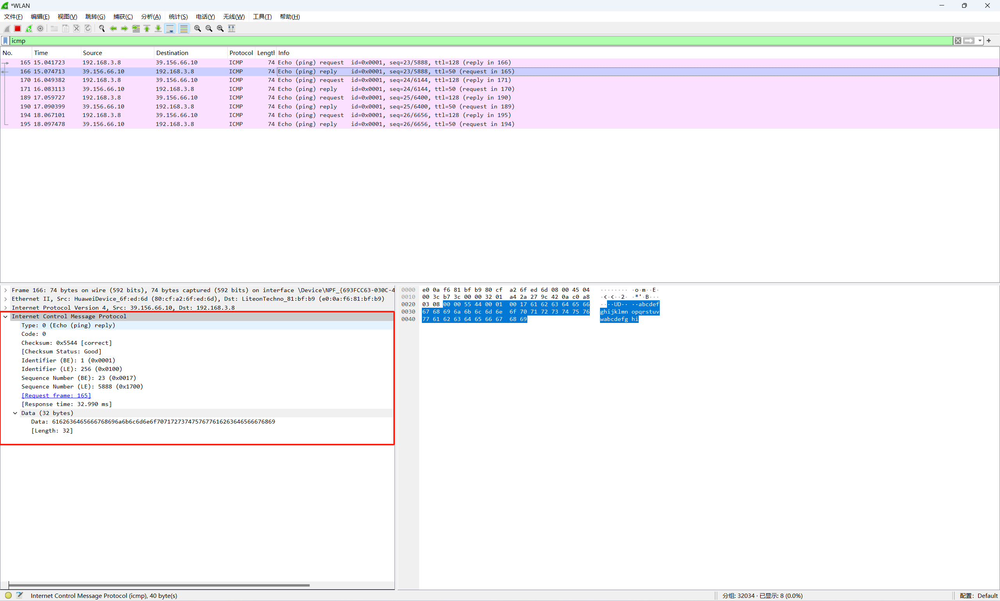

## ICMP

网际控制报文协议，Internet Control Message Protocol。

IP 协议尽最大努力的服务，把数据从源点交付到终点。但是它有两个缺点：缺少差错控制和缺少辅助机制。ICMPv4 就是为了补偿这两个缺点设计的。

**差错控制**，试想如果 IP 数据报 TTL 为零路由器必须丢弃数据时，怎么处理？如果目录主机在预设的时间范围内没有收到一个数据报的全部分片，因而必须把已经接收的分片全部丢弃时，又该怎么处理？这些情况 IP 协议都没有内建的解决机制。

**查询辅助机制**，IP 协议还缺少主机管理和查询所需要的机制。如判断路由器或者目的主机是否活跃。

ICMP 的设计就是为了弥补上述两个缺憾的。ICMP 协议位于网络层，但是它的报文并不直接传输给数据链路层。实际上 ICMP 报文要首先封装成 IP 数据报，然后才被传递到下一层。


## 报文格式

ICMP 报文由一个 **8 字节**的首部和可变长的数据部分组成。对于每种类型的报文，首部的格式一般都是不同的，但是前 4 个字节对所有的类型来说都是相同的。


第一个字段是 ICMP 报文的类型。

| 类型      | 报文                                     | 种类     |
| ------- | -------------------------------------- | ------ |
| 3       | 终点不可达（destination-unreachable message） | 差错报告报文 |
| 4       | 源点抑制                                   | 差错报告报文 |
| 11      | 超时                                     | 差错报告报文 |
| 12      | 参数问题                                   | 差错报告报文 |
| 5       | 改变路由                                   | 差错报告报文 |
| 8 或 0   | echo 请求或回答                             | 查询报文   |
| 13 或 14 | timestamp 请求或回答                        | 查询报文   |
## 查询报文

通过查询报文来对某些网络问题进行诊断，一共设计了五对不同的报文，但是其中三对已经过时。目前还在使用的：echo-request 和 echo-reply，timestamp-request 和 timestamp-reply。

### echo-request 和 echo-reply

`echo-request` 和 `echo-reply` 报文是为了诊断而设计的。`echo-request` 和 `echo-reply` 组合起来确定了两个系统（主机或路由器）之间能否彼此通信。

echo-request 和 echo-reply 报文可以用来确定两台机器在 IP 级能够彼此通信。因为 ICMP 报文被封装成数据报，发送 echo-request 的机器在收到 echo-reply 回到报文时，就证明了发送方和接收方之间能够用 IP 数据报进行通信。此外，这还证明了中间的路由器能够接收、处理和转发数据报。通常使用 ping 命令来测试主机的可达性。

标识符和序号字段在协议中没有正式定义，有意由发送方任意使用。标识符通常与发起请求的的进程ID是一致的。

echo-request 可以包含可选数据，这个数据必须由 echo-reply 在报文中一摸一样的重复一遍。

**抓包测试**

ping 百度的域名。
```
D:\suomea-note>ping baidu.com

正在 Ping baidu.com [39.156.66.10] 具有 32 字节的数据:
来自 39.156.66.10 的回复: 字节=32 时间=33ms TTL=50
来自 39.156.66.10 的回复: 字节=32 时间=33ms TTL=50
来自 39.156.66.10 的回复: 字节=32 时间=30ms TTL=50
来自 39.156.66.10 的回复: 字节=32 时间=30ms TTL=50

39.156.66.10 的 Ping 统计信息:
    数据包: 已发送 = 4，已接收 = 4，丢失 = 0 (0% 丢失)，
往返行程的估计时间(以毫秒为单位):
    最短 = 30ms，最长 = 33ms，平均 = 31ms
```

wireshark 抓包过滤 icmp 能够看到对应的 echo-request 和 echo-reply 请求。


第一个 echo-request 第一个 echo-reply 报文，对比能够发现两个报文的可选数据部分是一样的，均为 32 个字节。




### 时间戳请求和时间戳回答

两个主机可以使用 temestamp-request 和 timestamp-reply 报文来确定 IP 数据报在这两个机器之间来回所需的往返时间。它也可以用于同步两个机器的时钟（一般单独使用 NTP 协议）。
## 差错报告报文

IP 是一个不可靠的协议，IP 并不考虑差错检验和差错控制。之所以设计 ICMP 就是为了弥补这个缺点，不过 ICMP 不能纠正差错，它只是简单的报告差错。

差错纠正留给高层协议去错，差错报文总是发给最初的数据源，因为在数据报中关于路由的唯一可用信息就是源 IP 和目的 IP 地址。ICMP 总是把差错报文报给最初的数据源。

一共有 5 种差错处理，差错报告报文有如下规则：
- 对于携带 ICMP 差错报文的数据报，不再产生 ICMP 差错报文。（是不是 ICMP 差错报文如果丢失了也就丢失了。）
- 对于分片数据报，如果不是第一个分片，则不产生 ICMP 差错报文。
- 对于具有多播地址的数据报，不产生 ICMP 差错报文。
- 对于具有特殊地址（如 127.0.0.1 或 0.0.0.0）的数据报，不产生 ICMP 差错报文。

所有差错报告报文都包含一个数据部分，它包括原始数据报的 IP 首部再加上该数据报数据的前 8 个字节。之所以要加上原始数据的前 8 个字节是因为这前 8 个字节提供了关于端口号（TCP 和 UDP）和序号（TCP）的信息。

### 终点不可达

当路由器无法为一个数据报找到路由，或者主机无法交付一个数据报时，该数据报被丢弃，然后由路由器或主机向发出这个数据报的源主机返回一个终点不可达报文（destination-unreachable message）。

类型为 3。

代码 0：网络不可达。可能是硬件发生故障导致的。
代码 1：主机不可达。可能是硬件发生故障导致的。
代码 2：协议不可达。IP 数据报可以携带属于某个高层协议的数据，如 UDP、TCP 和 OSPF。例如，目的主机收到一个数据报必须交付给 TCP 协议，但 TCP 协议并未运行。
代码 3：端口不可达。数据报要交付的目标程序并未运行。
代码 4：需要进行分片，但是 IP 数据报的 DF 字段已被设置。
代码 5：源路由不能完成，即在源路由选项中定义的一个或多个路由器无法通过。
代码 6：目的网络未知。与代码 0 不同的是，代码 0 表示路由器知道目的网络的存在而无法到达，代码 6 表示路由器没有目的网络的信息。
代码 7：目的主机位置。与代码 1 不同的是，代码 1 表示路由器知道目的主机的存在而无法到达，代码 7 表示路由器没有目的主机的信息。
代码 8：源主机被隔离了。
代码 9：从管理上禁止与目的网络通信。
代码 10：从管理上禁止与目的主机通信。
代码 11：对指明的服务类型，网络不可达。
代码 12：对指明的服务类型，主机不可达。
代码 13：主机不可达，因为管理员已经在这个主机上放置了过滤器。
代码 14：主机不可达，因为主机违反了优先级策略。
代码 15：主机不可达，因为它的优先级被截至。

> 代码 2 或 3 的终点不可达报文只能由目的主机创建。其余的终点不可达报文只能由路由器创建。
> 路由器无法检测出导致分组没有交付的所有问题，所以即使路由器没有发送终点不可达报文，也不一定表示数据已经被交付了。

首部的其余部分未使用。

### 源点抑制

 IP 协议是无连接协议。在产生产生数据报的源主机和转发数据报的路由器以及处理数据报的目的主机之间没有任何通信联系。这种缺乏通信所引起的一个问题就是缺乏流量控制和拥塞控制。

> 在 IP 协议中没有流量控制和拥塞控制。

源点 抑制报文 source-quench message，即使为了给 IP 协议增加某种程度的流量控制和拥塞控制而设计的。

当路由器或主机因拥塞而丢弃数据报时，它就向该数据报发送方发送一个源点抑制报文。这个报文有两个作用。
- 第一，同时源点数据已经被丢弃。

- 第二，警告源点，在当前链路的某处出现了拥塞，因而源点要放慢发送过程。

类型为 4。

代码为 0.

首部的其余部分未使用。

遭遇拥塞的路由器或目的主机必须为每一个丢弃的数据报向源主机发送一个源点抑制报文。

没有一种机制可以告诉源点，拥塞已经得到缓解，可以按照原来的速率发送数据报了。源点只是不断的降低发送速率，直到不再收到更多的源点抑制报文为止。

在多对一的通信情况下，路由器或者目的主机并不知道哪一个源点应该对拥塞负责。所以它有可能丢弃了低速率源点的数据包，而没有丢弃真正产生拥塞的源点发送的数据报。

### 超时

超时报文 time-exceeded message，在以下两种情况产生。
- 当路由器发现 IP 数据包的 TTL 字段变为 0 后，就丢弃这个数据报，并向源点发送一个超时报文。

- 当组成一个报文的所有分片未能在某一限定时间内全部达到目的主机，也要产生一个超时报文。当第一个分片达到时，目的主机就启动一个计时器。如果计时器到时，却没有收齐所有的分片，目的主机就将已收到的分片全部丢弃，并向源点发送一个超时报文。

类型为 11。

代码为 0 或 1。0 表示 TTL 原因丢弃，仅供路由器使用；1 表示分片接收超时丢弃，仅供目的主机使用。

首部的其余部分未使用。

## 校验和

发送方按照以下步骤计算：

	1.把校验和字段置为零。

	2.计算所有 16 位字（首部）之和，采用二进制反码加法。

	3.把得到的和取反码存储在校验和字段中。

接收方按照以下步骤检验：

	1.计算所有 16 位字（首部）之和，采用二进制反码加法。

	2.把得到的和求反码。

	3.如果步骤 2 得到的结果是零，则接受这个报文，否则丢弃。

## Ping

ping 主要通过 ICMP 协议来进测试网络 IP 层的状况。
```
# ping [选项参数] IP

选项参数：
-c <数值>：后面接的是执行 ping 的次数，例如，-c 5。

-s <数值>：发送出去 ICMP 包含可选数据的大小，默认为 56 字节。一般加上 20 字节的 IP 首部（不包含 options）和 8 字节的 ICMP 首部才是到达本机数据链路层的大小。

-t <数值>：指定 IP 协议 TTL 生存时间字段的值，每经过一个节点就会少 1。

-W <数值>：等待对方主机回应的秒数。

-M [do|dont|want]：用于设置路径 MTU 限制及控制分片行为，主要的选项是：
	do：设置 IP 首部的 DF（Don't Fragment）标志为 1，使数据链路层不能对 IP 数据报进行分片，如果数据链路层不能发送（超出 MTU）该数据报则丢弃。
	dont：不设置 DF 标志，表示 IP 数据报可以被数据链路层分片。
```

ping 测试示例
```
# ping -c 5 baidu.com
PING baidu.com (110.242.68.66) 56(84) bytes of data.
64 bytes from 110.242.68.66: icmp_seq=1 ttl=50 time=27.0 ms
64 bytes from 110.242.68.66: icmp_seq=2 ttl=50 time=26.9 ms
64 bytes from 110.242.68.66: icmp_seq=3 ttl=50 time=26.9 ms
64 bytes from 110.242.68.66: icmp_seq=4 ttl=50 time=27.0 ms
64 bytes from 110.242.68.66: icmp_seq=5 ttl=50 time=26.9 ms

--- baidu.com ping statistics ---
5 packets transmitted, 5 received, 0% packet loss, time 6043ms
rtt min/avg/max/mdev = 26.927/26.948/26.979/0.019 ms
```

第一行 `56(84) bytes of data` 表示 ICMP 可选数据的大小为 56 字节，加上 8 字节的 ICMP 首部和 20 字节的 IP 首部共 84 字节。

第二行 
- 64 bytes：表示这次传送的 ICMP 数据包的大小为 64 bytes。
- icmp_seq=1：ICMP 侦测进行的测试，第一次就为 1.
- ttl=50：IP 首部 TTL字段的值，默认为 50，可以使用 -t 进行设置。
- time=27.0ms：IMCP 数据报的往返传播时间，Round-Trip Time，rtt。

> ping 通过本机时间测试 rtt = echo-request 发送出去的时间 - echo-reply 接受到的时间。NTP 先测试 delay，然后再根据 delay 测试机器之前的 offset。


最后三行为统计信息。

### 用 ping 来追踪路径 MTU 数值。

```
ping -s 100 -M do baidu.com
```

`-s` 设置了 ICMP 可选数据大小。

`-M do` 表示数据链路层不能分片 IP 数据报。

如果执行命令没有反应，则表示路径 MTU 小于 100 + 8 + 20 字节。一般以太网卡的 MTU 为 1500 字节。