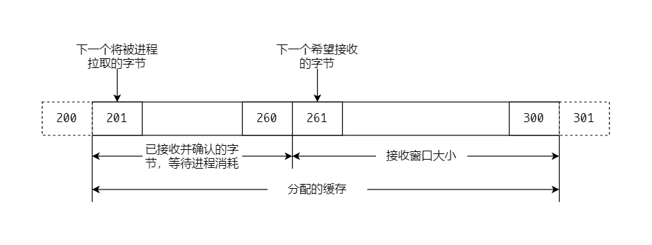
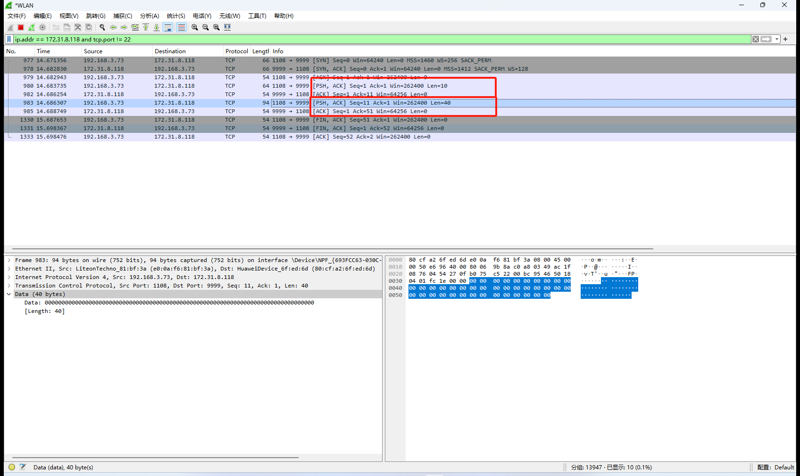

## 介绍

### 进程到进程的通信

与 UDP 一样，TCP 也是使用端口号提供进程到进程的通信。

### 流交付服务

和 UDP 不同，TCP 是一种面向流的协议。在 UDP 中，进程把预先定义好编辑的报文传送给 UDP 以便进行交付，不论是 UDP 还是 IP 都不认为两个 UDP 数据报之间存在关联关系。

TCP 则允许发送进程以字节流的形式传递数据，也允许接收进程把数据作为字节流来接收。

### 全双工通信

TCP 提供全双工服务，即数据可以在同一时间双向流动。TCP 的两个端点的 Scoket 分别有自己的发送缓存和接收缓存，报文段可以在两个方向运动。

### 面向连接的服务

和 UDP 不同，TCP 是面向连接的协议。

TCP 使用 IP 的服务把一个个报文段交付给接收方，但是连接本身是由 TCP 控制的。如果一个报文段丢失或收到损伤，那么这个报文段就被重传，IP 并不知道 TCP 的重传行为；如果一个报文段没有按序到达，那么 TCP 会保留它，直到丢失的报文达到为止，但是 IP 并不知道这个重新排序的过程。

## 编号系统

**序号**
TCP 把在一个连接中要发送的所有数据字节都编上号。两个方向的编号是相互独立的。当 TCP 接收来自进程的数据字节时，就把它们存储在发送缓存中，并为它们进行编号。
!!!note "需要注意的是缓存是和 Socket 对应的，Socket 在 TCP 的两端分别有独立的发送和接收缓存。一个进程可以关联多个 Socket。"

编号不一定要从 0 开始。如果起始编号恰好是 1057，而要发送的数据总共 6000 字节，那么这些字节的编号就是从 1057~7056。

当所有字节都被编上号以后，TCP 就给每一个要发送的报文段指派一个序号。每个报文段的序号就是这个报文段中第一个数据字节被分配的编号。

**确认号**
当一条连接建立后，双方能同时发送和接收数据，通常双方从不同的起始编号开始对字节编号。双方还使用了确认号对各自收到的字节表示确认，不过这个确认号定义的是它期望接收到的下一个自己的编号。另外确认号是累积，意思是如果某一方使用 5643 作为确认号，那就表示它已经收到了从开始一直到编号为 5642 的所有字节。


## 格式

报文段包括了 20~60 字节的首部，其后是应用程序的数据。首部在没有选项时是 20 字节，如果有选项最多可达 60 字节。首部格式如下。

**源端口地址** 16 位的字段，定义发送这个报文段的主机的应用程序的端口号。

**目的端口i地址** 16 位的字段，定义了接收这个报文段的主机的应用程序的端口号。

**序号** 32 位字段，定义了指派给本报文段第一个数据字节的编号。在建立连接时，双方使用各自的随机数产生器产生一个初始序号（Initial Sequence Number，ISN）。通常情况下，两个方向上的 ISN 是不同的。

**确认号** 32 位字段，定义了报文段的接收方期望从对方接收的字节编号。如果报文段的接收方成功接收了对方发来的编号为 x 的字节，那么它就返回 x+1 作为确认号。确认可以和数据捎带在一起发送。

**首部长度** 4 位字段，定义了 TCP 首部一共有多少个 4 字字节。首部长度可以在 20~60 字节之间。因此这个字段的值可以在 5 到 15 之间。

**保留** 6 位字段，保留为今后使用。

**控制** 共 6 位。在同一时间可设置一位或多位标志。

- URG 紧急指针有效的。
- ACK 确认是有效的。
- PSH 请求推送。
- RST 连接复位。
- SYN 同步序号。
- FIN 终止连接。

**窗口大小** 16 位字段，这个字段定义的是发送 TCP 的窗口大小，以字节为单位。窗口大小是由接收方决定的，发送方服从接收方的指示。只有当一个报文段中包含了确认时，定义窗口大小才有意义。

**校验和** 16 位字段。TCP 校验和字段是强制的，和 UDP 一样校验和的计算要包含伪首部和数据部分。

**紧急指针** 16 位字段，只有当紧急标志位时，这个字段才有效，此时报文段中包含了紧急数据。紧急指针定义了一个数值，把这个数值加到序号上就得出报文段数据部分中最后一个紧急字节的编号。

**选项** TCP 首部中有可以多大 40 字节的选项信息。


## 连接

在 TCP 中，面向连接的传输需要经历三个阶段：连接建立、数据传输和连接终止。

### 建立连接

**三向握手**  


**客户端主动打开，C->S 发送报文，seq: x，SYN。**

客户端发送第一个报文段（SYN 报文段），在这个报文段中 SYN 标志置为 1。

SYN 报文段不携带任何数据，但是它要消耗一个序号，这个序号称为初始序号 ISN。

这个报文段不包括确认号，也没有定义窗口大小。只有当一个报文段中包含了确认时，定义窗口大小才有意义。

**服务端被动打开，S->C发送报文，seq: y，ack: x+1，SYN，ACK，rwnd: 5000。**

服务端发送第二个报文段，即 SYN+ACK 报文段，报文段中的这两个标志置 1。SYN + ACK 报文段不携带任何数据，但是它要消耗一个序号。

这个报文段有两个目的，首先。它是另一个方向上通信的 SYN 报文段。服务器使用这个报文段来同步它的初始序号，以便服务器向客户端发送字节。其次，服务器还通过 ACK 标志来确认已收到来自客户端的 SYN 报文段，同时给出期望从客户端客户端收到的下一个序号。

因为这个报文段包含了确认，所以它还需要定义接收窗口大小，即 rwnd，由客户端使用。

**客户端确认，C->S发送报文，seq: x，ack: y+1，ACK，rwnd: 3000。**

客户端发送第三个报文段。这仅仅是一个 ACK 报文段，它使用 ACK 标志和确认号来确认收到了第二个报文段。

需要注意的是这个报文段的序号 SYN 报文段使用的序号一样，即这个 ACK 报文段不消耗任何序号。

客户端在这个报文段中定义服务端发送窗口的大小。

!!!note 关于客户端确认的序号
	最后一次握手的序号也可能是 `x+1`，在使用后面的 `EchoServer` 示例进行抓包时，客户端第三次握手发送的序号就是 `x+1`，但是客户端并没有消耗掉这个序号。在握手结束后，客户端发送的第一个报文段的序号仍是 `x+1`。

**SYN 洪泛攻击**  
当一个或多个恶意攻击的攻击者向某台服务器发送大量的 SYN 报文段，并通过伪造报文段中的源 IP 地址来假装每一个报文段来自不同的客户端时，这个问题就发生了。服务器认为这些客户端发来了主动打开请求，于是就分配必要的资源，并设置一些计时器。然后服务器向这些假冒的客户端发送 SYN+ACK 报文段，而这些报文段都丢失了。

如果在很短的时间内，SYN 报文段的数量很大，服务器最终会因为资源耗尽而不能接受来自合法客户端的连接请求。这种 SYN 洪泛攻击属于拒绝服务（DOS）攻击，即攻击者用大量的服务请求垄断了一个系统，使这个系统因超载而拒绝为合法的请求提供服务。

### 数据传送

在建立连接之后，双向的数据传送就可以开始。客户端和服务器可以在两个方向上传送数据，并且在同一个报文段中也可以携带确认。

### 连接中止

参与数据交换的双方中的任何一方都可以关闭连接，一般来说这是由客户端启动的。目前，大多数 TCP 实现允许连接终止时有两种选择：三向握手和具有办关闭属性的四向握手。

**三向握手**  

**客户端主动关闭，C->S 发送报文，seq: x，FIN+ACK。**

客户端在收到进程的关闭命令后，就发送一个报文段，这是一个将 FIN 标志置 1 的报文段。
zhixiao
FIN 报文段可以包含客户端发送的最后一块数据。或者仅仅只是一个控制报文段，不包含数据的话仅消耗一个序号。

**服务端被动关闭，S->C 发送报文，seq: y，ack: x+1，FIN+ACK。**

服务端在收到客户端的 FIN 报文段后，发送了第二个报文段 FIN+ACK 报文段，以证实它收到了来自客户端的 FIN 报文段，同时也宣布另一个方向正在关闭连接。

这个报文段也可以携带服务端的最后一块数据。如果它不携带数据，则只消耗一个序号。

**客户端确认，C->S 发送报文，seq: x，ack: y+1，ACK。**

客户端发送最后一个 ACK 报文段，以证实从 TCP 服务端收到了 FIN 报文段。

这个报文段不携带数据，并且也不消耗序号。

**半关闭**  
在 TCP 中，连接的一方可以停止发送数据，但是仍然可以接收数据，这就称为半关闭，half-close。

常见的情况是，客户端在在发送完所有的数据之后，可以把客户端到服务器方向的连接关闭。但是，从服务端到客户端连接可以是继续打开的，以便服务端处理完客户端的数据之后将处理结果发送给客户端。


**客户端主动关闭，C->S 发送报文，seq: x，ack: y，FIN+ACK。**

从客户端到服务端的数据传送结束了，客户端就发送一个 FIN 报文段，此连接被半关闭了。

**服务端确认，S->C 发送报文，seq: y-1，ack: x+1，ACK。**

服务端发送 ACK 报文段表示接受半关闭，但是这个时候服务端仍是可以发送数据的。

注意这个单纯的 ACK 报文段是不消耗序号的。

<-- 服务端到客户端报文段 -|- 客户端到服务端的确认 -->

**服务端主动关闭，S->C 发送报文段，seq: z，ack: x+1，FIN+ACK。**

服务端发送完数据之后，关闭服务端到客户端的连接。

**客户端确认，S->C 发送报文段，seq: x，ack: z+ 1，ACK。**

连接关闭，需要注意 ACK 报文段并未消耗序号。

## 状态列表


| 状态          | 说明                            |
| ----------- | ----------------------------- |
| `CLOSED`      | 没有连接。                         |
| `LISTEN`      | 收到了被动打开，等待 SYN。               |
| `SYN-SENT`    | 已发送了 SYN，等待 ACK。              |
| `SYN-RCVD`    | 已发送了 SYN+ACK，等待 ACK。          |
| `ESTABLISHED` | 连接建立，数据传送在进行。                 |
| `FIN-WAIT1`   | 第一个 FIN 已发送，等待 ACK。           |
| `FIN-WAIT2`   | 对第一个 FIN 的 ACK 已收到，等待第二个 FIN。 |
| `CLOSE-WAIT`  | 收到第一个 FIN，已发送 ACK，等待应用程序关闭。   |
| `TIME-WAIT`   | 收到第二个 FIN，已发送 ACK，等待 2MSL 超时。 |
| `LAST-ACK`    | 已发送第二个 FIN，等待 ACK。            |
| `CLOSING`     | 双方都以决定同时关闭。                   |

### 建立连接和半关闭中止
下图展示了 TCP 建立连接和半关闭终止的时间线图。

**客户端状态**

客户进程向 TCP 发出命令，请求连接某个特定的套接字地址，这就称为主打开。于是 TCP 发出一个 SYN 报文段，进入到 `SYN-SENT` 状态。

在收到 SYN+ACK 报文段后，TCP 发送 ACK 报文段，并进入 `ESTABLISHED` 状态。此后数据开始传送和确认。

当客户没有更多的数据要传送时，就发出称为主动关闭的命令。于是 TCP 发送 FIN 报文段，并进入到 `FIN-WAIT-1` 状态。当客户端收到对刚才发送的 FIN 报文段的 ACK 后就进入到 `FIN-WAIT-2` 状态，并继续停留在这个状态，直到收到服务器的 FIN 报文段为止。

在收到服务器的 FIN 报文段后，客户端就发送 ACK 报文段，并进入 `TIME-WAIT` 状态，同时设置一个计时器，它的超时时间是最大报文段寿命（Maximum Segment Lifetime，MSL）的两倍。

!!!tip "为什么客户端在收到服务端的 FIN 之后不立即进入 `CLOSED` 状态，而是要进入 `TIME-WAIT` 状态并且等待两个 MSL？"
	第一、如果最后一个 ACK 丢失，那么服务器会认为是服务器自己的 FIN 丢失（它为最后的 FIN 设置了计时器），因而重传，但是如果客户端已经关闭的话，那么服务器无法关闭连接（肯定还是有办法关闭的，等待超时或者达到最大连接数）。2MSL 计时器可以使客户等待足够长的时间，使得 ACK 丢失（一个 MSL）的情况下等待另一个 FIN 的到来（一个 MSL）。
	
	如果客户端在 TIME-WAIT 状态中有一个新的 FIN 达到，客户端就发送一个新的 ACK，并重新启动 2MSL 计时器。

	第二、假定客户端和服务端已经关闭了连接，紧接着立马又新建了一个连接，并且和上一个连接使用的使同一个套接字地址的。这样的新连接称为旧连接的`化身`。没有 2MSL 的话，这两个连接的间隔时间很短，有可能前一个连接的重复报文到达新的连接中。为了避免这个问题等待 2MSL 足够重复让报文段在链路中被丢弃，而不干扰新的连接。

**服务端状态**

服务端首先要进入 `LISTEN` 状态，并继续处于这个状态中，直到收到 SYN 报文段为止。

当服务端收到 SYN 报文段之后，就发送 SYN+ACK 报文段，并进入 `SYN-RCVD` 状态，等待客户端的 ACK 报文段。

在收到 ACK 报文段之后，就进入到 `ESTABLISHED` 状态，此时可以进行数据传送。

TCP 可以一直保持在 `ESTABLISHED` 状态，直到收到来自客户端的 FIN 报文段，这表示客户端没有数据要发送了，因而可以关闭连接。服务端想客户端发送 ACK 报文段，并发送队列中尚未发送完的数据，然后进入 `CLOSE-WAIT` 状态。

此时连接时半关闭的状态，服务端 TCP 可以向客户端发送数据和接收确认，但是没有反方向的数据能够传送过来。服务端可以一直处于这个状态，直到应用程序真正地发出关闭命令。

服务端 TCP 发送 FIN 报文段，表示要关闭这个连接，并进入到 `LAST-ACK` 状态。服务器 TCP 一直处于这个状态直到收到最后的 ACK 报文段，然后进入 `CLOSED` 状态。

### 拒绝连接

一种常见的情况是，客户端请求服务器的端口建立连接，但是服务端的端口并没有处于 `LISTEN` 状态。

服务器 TCP 在收到这样的 SYN 报文段后会发送一个 RST+ACK 报文段，它确认了 SYN 报文段，但于此同时重置这条连接。

客户端在收到这个 RST+ACK 报文段后进入 `CLOSED` 状态。


## TCP 中的窗口
TCP 连接通信双方共有四个窗口，客户端和服务端又各自的发送和接收窗口。

### 发送窗口


虽然 TCP 传输的是一个一个的报文段，但是用于控制窗口的变量是以字节为单位的。滑动窗口内的数据是应用层的数据，也即 TCP 报文段的数据部分，而不是整个 TCP 报文段的数据。

窗口左沿外的数据可以从缓存中清除。窗口右沿外的数据不允许发送，除非窗口右沿向右移动。

**关闭** 窗口的左壁向右移动。窗口的左壁不会向左移动。
**打开** 窗口的右壁向右移动。
**收缩** 窗口的右壁向左移动。

### 接收窗口

TCP 允许进程按照字节的节奏来拉取数据，也就是说，分配给接收方的缓存中，可能有一部分被已接收和确认但正等待接收进程来拉取的数据占用。因此，接收窗口的大小总是小于或等于缓存大小。接收窗口 rwnd 可以用以下公式来计算。
```
rwnd = 缓存大小 - 正在等待被进程拉取的字节数
```

**关闭** 窗口的左壁向左移动。窗口的左壁不会向左移动。
**打开** 窗口的右壁向右移动。（假设窗口的右壁不会向左移动，虽然偶尔会发生这种情况。）

## 流量控制

为了实现流量控制，TCP 的发送方和接收方需要不断调整它们的窗口大小，即使双方的缓存在建立连接是就被固定下来了。

当有更多的字节从发送方传过来时，接收窗口关闭，而当更多的字节被进程拉取走时，接收窗口打开。

发送窗口的打开、关闭和收缩是被接收方所控制的。当一个新的确认到达，且在这个确认允许时，发送窗口会关闭。

当由接收方通告的接收窗口的大小 rwnd 允许时，发送窗口会打开。

### 一种假设的情况
下面描述的是在建立阶段如何设置发送窗口和接收窗口，并且在数据传送时状态又是如何发生改变的。我们先忽略差错控制，假设没有报文段损坏、丢失、重复或失序到达。下面描述的是一个单项数据传送，从客户端到服务器的简单例子。

第一个报文是客户端发送 SYN 报文段，ISN 为 100，请求建立连接。当报文段达到服务器时，服务器分配一个大小为 800 字节的缓存，并设置它的接收窗口覆盖整个缓存。

第二个报文段是从服务端到客户端。这是一个 SYN+ACK 报文段。这个报文段的 ack=101，同时宣布了客户端可以将发送窗口大小设置为 800 字节。

第三个报文段是客户端到服务端的 ACK 报文段。

当客户端根据服务端的指示设置自己的窗口 800 字节之后，进程推送 200 字节的数据。TCP 客户端用 101~300 给这些字节编号，然后创建一个报文段并将其发送至服务端。报文段显示起始字节编号为 101，并且携带了 200 字节的数据。客户端会调整窗口，来表示已发送 200 字节的数据，且正在等待确认。当这个报文达到服务端后，这些字节被保存下来，接收窗口关闭以表示下一个希望接收的字节是 301。被保存的字节占用了缓存中的 200 字节。

第五个报文是服务端到客户端的反馈，服务端确认了编号 300 及其之前的所有字节。这个报文段还携带了一个减小之后的接收窗口大小（600）。客户端在接收到这个报文之后，将以被确认的数据从发送窗口清除出去，并关闭窗口，以表示下一个要发送的字节是 301。但是这个窗口的大小要缩减至 600。虽然分配的缓存能够放得下 800 字节，但是窗口不能将其右壁向右移动，因为接收方没有允许它这样做。

当客户进程又推送另外的 300 字节，TCP 发送报文段 6。这个报文段的序号是 301，并且包含了 300 个字节。当这个报文段到达服务端之后，服务端将它们保存下来，但是服务端必须减少接收窗口的大小。在服务端进程拉取了 100 个字节的数据之后，窗口从左边关闭 300 个字节，同时又向右边打开 100 个字节。现在接收窗口的大小是 400 字节。

在第七个报文段中，服务端对收到的字节进行确认，并宣布接收窗口的大小是 400。当这个报文到达客户端后，客户端没有其他选择，只能再一次将窗口减小。客户端将发送窗口从左边关闭 300 字节，并在右边打开 100 字节。

报文段八是服务器进程又一次拉取了 200 字节之后从服务器发出的。服务端的窗口大小增加了，现在，新的 rwnd 是 600。这个报文段告诉客户端，服务端仍在期盼着字节 601，但是服务端的窗口大小已经扩展到 600 了。注意，这个报文段的发送与否取决于具体实现的策略。当这个报文段到达客户端后，客户端将发送窗口再打开 200 字节，并且没有做任何动作。

### 窗口的收缩
接收窗口不允许收缩。

发送窗口，如果接收方指定的 rwnd 值会导致发送窗口缩小，那么发送窗口就收缩。

某些实现是不允许发送窗口收缩的，它限制了发送窗口的右璧不允许向左移动。为了防止发送窗口的收缩，接收方在最近的和新的确认以及最近的和新的 rwnd 值之间始终要满足下述关系：
```
新的 ackNo + 新的 rwnd >= 最近的 ackNo + 最近的 rwnd
```
这个不等式的左边代表了右璧的新位置，右侧代表了窗口右璧原来的位置。这个关系说明窗口右璧不会向左移动（收缩）。

### 窗口的关闭
发送窗口的右璧左移以收缩发送窗口是非常不希望出现的。但是有一个例外：接收端可以发送 rwnd 为 0 的报文段来暂时关闭窗口。这种情况的发生是由于接收方因为某种原因在一段时间内不愿意从发送方接收任何数据。此时，发送方实际上并非真正的把窗口大小收缩了，而是暂停发送数据，直到收到一个新的通告为止。实际上，即使关闭了发送窗口，发送方仍然可以发送具有一个字节的报文段，称为探测，用于防止死锁。

### 糊涂窗口综合征
当发送应用程序产生数据的速度很慢，或者接收应用程序消耗的速度很慢，或者两者都有。不管上述哪一种情况，都会使得发送数据的报文段很小，这就会降低运行效率。例如，假若 TCP 发送的报文段只包含 1 个字节的数据，那么意味着我们为传送 1 字节的数据而送了 41 字节的数据（20 字节的 TCP 首部和 20 字节的 IP 首部）。这时使用网络的效率非常低，如果在算上数据链路层和物理层的开销后，这种低效率就更加严重了。这个问题称为**糊涂窗口综合征（silly window syndrome）**。

**发送方产生的症状**
如果发送 TCP 正在为一个产生数据速度很慢的应用程序服务，例如一次产生 1 个字节，那么就可能产生糊涂窗口综合征。应用程序一次把 1 个字节的数据写入到发送 TCP 的缓存。如果发送 TCP 没有任何特殊的指令，它就会产生只包括 1 个字节数据的报文段。其结果就是很多个 41 字节的报文段在互联网中传来传去。

解决问题的办法就是防止 TCP 一个一个字节的发送数据。必须要强迫发送 TCP 等待，并把数据收集成较大的数据块后再发送。发送 TCP 等待多长时间呢？如果等待过长，就会延迟了处理过程，如果等待的时间不够长，最后很可能还是发送一个个小的报文段。

Nagle 算法找到了一个很精巧的解决办法：
1. 发送 TCP 把它从发送应用程序收到的第一块数据发送出去，哪怕只有一个字节。
2. 在发送了第一个报文段后，发送 TCP 就在输出缓存中积累数据并等待，直到收到 TCP 发来的确认，或者已积累了足够的数据可以封装成最大长度的报文段。这时，发送 TCP 据可以啊发送这个报文段了。
3. 对剩下的传输，不断重复步骤 2。

Nagle 算法的精妙之处在于它的简单，并且实际上权衡了应用程序产生的速率和网络运输数据的速率。若应用程序比网络块，则报文段较大；若应用程序比网络慢，则报文段较小。

默认情况下 Nagle 算法是启动的，Java 可以通过 `setTcpNoNagle(true);` 来禁用 Nagle 算法。
```java
Socket socket = new Socket();  
socket.setTcpNoDelay(true);
```

Nagle 算法出现的时候网络的带宽都很小，当有大量小包传输时，很容易将带宽占满，出现丢包重传等现象。Nagle 算法的作用是减少小包在客户端和服务端直接传输。

一般对时延敏感的程序 Nagle 算法的意义就不大了。比如在线游戏，可以禁用 Nagle 算法来减少延迟

**测试**

服务端 `nc -l 9999` 监听端口。

客户端代码
```java
package tcp;  
  
import java.io.OutputStream;  
import java.net.InetSocketAddress;  
import java.net.Socket;  
import java.util.concurrent.TimeUnit;  
  
public class NagleClient {  
  
    public static void main(String[] args) throws Exception {  
        Socket socket = new Socket();  
        socket.connect(new InetSocketAddress("172.31.8.118", 9999));  
        OutputStream out = socket.getOutputStream();  
        byte[] request = new byte[10];  
        for (int i = 0; i < 5; i ++) {  
            out.write(request);  
        }  
  
        TimeUnit.SECONDS.sleep(1);  
        socket.close();  
    }  
}
```

抓包能过够发现，握手结束之后立马发送了第一个包，数据为 10 个字节。然后发送第二个数据包，数据为 40 字节。


设置`socket.setTcpNoDelay(true);`之后，抓包能够发现，连续发送了 5 个 10 字节的数据包。


**接收方产生的症状**
如果接收 TCP 为一个消耗数据很慢的应用程序服务，例如一次消耗一个字节，它就有可能产生糊涂窗口综合征。因为如果接收窗口满了之后，每次释放一个字节，然后通知发送方可以调整窗口为 1，发送一个字节继续等待。

对于这种糊涂窗口综合征，即应用程序消耗数据的速度比数据到达的速度慢，有两种建议的解决办法。

**Clark 解决方法** 只要有数据到达就发送确认，但在缓存中有足够大的空间放入最大长度报文段之前，或者至少有一半的缓存空间之前，一直都宣布窗口大小为零。

**推迟确认** 第二种解决方法是推迟确认。这就表示当报文段达到时并不立即发送确认。接收方在对收到的报文段进行确认之前一直等待，直至输入缓存有足够的空间为止。推迟发送确认防止了发送 TCP 滑动它的窗口。发送 TCP 在发送了数据之后就停下来，因而防止了这种症状出现。

推迟确认还有另外一个优点，它减少了通信量。接收方不需要对每一个报文段进行确认。但是它有一个缺点，就是确认的推迟有可能迫使发送方重传未被确认的报文段。当然 TCP 可以进行平衡，推迟的时间不能超过一个值。

## 差错控制
TCP 是可靠的运输层协议。这就表示应用层把数据流交付给 TCP 后，就要依靠 TCP 把整个数据流交付给另一端的应用程序，并且是按序的、没有差错、也没有任何一部分丢失或重复。

TCP 使用差错控制来提供可靠性。差错控制包括以下一些机制：检测和重传收到损伤的报文、重传丢失的报文段、保存失序达到的报文段直至缺失的报文段到齐，以及检测和丢弃重复的报文段。TCP 通过使用三个工具来完成其差错控制：校验和、确认和超时。

### 校验和
每个报文段都包含了一个校验和字段，用来检测报文段是否受到损伤。如果某个报文段因校验和无效而被检测出收到损伤，就由终点 TCP 将其丢弃。

### 确认

TCP 采用确认来证实收到了报文段。ACK 报文段不消耗序号，也不需要被确认。

**累计确认 ACK** TCP 最初的设计是对收到的报文段进行累计确认。接收方通告它期望接收的下一个字节的序号，并忽略所有失序达到并被保存的报文段。对于丢弃、丢失或重复的报文段都不提供任何反馈。在 TCP 首部中的 32 位 ACK 字段用于累积确认，而它的值仅在 ACK 标志为 1 时才有效。

**选择确认 SACK** SACK 并没有取代 ACK，而是向发送方报告了更多的信息。SACK 要报告失序的数据块以及重复的报文段（即使收到不止一次）。但是，TCP 首部并未提供增加这类信息的地方，因此 SACK 是作为 TCP 首部末尾的选项来实现的。

什么时候产生确认？不同的实现可能有不同的规则，下面是几个常用的规则。
1. 当 A 端向 B 端发送数据报文段时，必须捎带一个确认，它给出了 A 端期望接收的下一个字节的序号。这条规则减少了所需的报文段的数量，因而减少了通信量。

2. 当接收方没有数据要发送，但是收到了按序达到（序号是期望的）的报文段，同时前一个报文段也已经确认过了，那么接收方就延迟发送确认报文段，直到另一个报文段达到，或经过了一段时间（通常是 500ms）。换言之，如果仅仅由一个按序到达的报文段没有被确认，接收方就要延迟发送确认报文段。这条规则也减少了 ACK 报文段的通信量。

3. 当所期望的序号的报文段到达，而且前一个按序到达的报文段还没有被确认，那么接收方就要立即发送 ACK 报文段。换言之，在任何时候，不能有两个以上按序到达的报文段未被确认。这就避免了不必要的重传。

4. 当序号比期望的序号还大的报文段达到时，接收方立刻发送 ACK 报文段，并宣布下一个期望的报文段序号。这会导致对丢失报文段的快重传。

5. 当一个丢失的报文段到达时，接收方要发送 ACK 报文段，并宣布下一个期望的序号。这是告诉接收方，被通报为丢失的报文段已经收到了。

6. 如果到达一个重复的报文段（有可能是接收方的 ACK 丢失了，导致发送方超时重传），接受方就丢弃该报文段，但是应当立即发送确认，指出下一个期望的报文段。这就解决了 ACK 报文段本身丢失所带来的一些问题。
### 重传
差错控制机制的核心就是报文段的重传。在一个报文段发送时，它会被保存到一个队列中，直到被确认为止。当重传计时器超时，或者发送方收到该队列中第一个报文段的三个重复的 ACK 时，该报文段被重传。

**RTO 之后的重传**
发送方 TCP 为每一条连接设置一个重传超时（retransmission time-out，RTO）计时器。当计时器时间超时，TCP 发送队列中最前面的**报文段**，即序号最小的报文段，并重启计时器。在 TCP 中 RTO 的值是动态的，它根据报文段的往返时间更新。

!!!note "超时重传计时器"
	需要注意的是，计时器作用的地方是报文段的缓存队列，而不是滑动窗口。

**三个重复的 ACK 报文段之后的重传**
如果 RTO 值不是很大，前面描述的重传报文段的规则就足够了。但是如果允许发送方更快的重传，而不用等待计时器超时，就能更有利于网络吞吐量，因此现在的大多数实现都遵守收到三个重复 ACK 则立即重传丢失的报文段规则。这一特性被称为快重传（fast retransmission）。

### 失序的报文段
TCP 实现基本上不会丢失失序到达的报文段，而是把这些报文段暂时保存下来，并把它们标志位失序报文段，直至缺失的报文段到齐。注意，TCP 不会把失序的报文段交付给进程。

### TCP 数据传送的 FSM

**收到来自应用的字节块**
产生一个报文段，并存报文段的副本，并发送该报文段。如果这个报文段是发送缓存队列中的第一个报文段，启动计时器。


### 几种情况

**正常运行**

**报文段丢失**

**快重传**

**延迟的报文段**

**重复的报文段**

**自动纠正丢失的 ACK**

**丢失的确认被重传的报文段纠正**


**因确认丢失而产生的死锁**
当接收方发送了确认，同时把 rwnd 置为 0，也就是请求发送方暂时关闭其窗口，就会出现这种情况了。过了一段时间之后，接收方打算取消这一限制，但是如果它没有数据要发送，就会发送 ACK 报文段，并且用 rwnd 等于一个非零的数值来取消这个限制。

如果这个确认丢失了，那么就会产生问题。发送方一直在等待确认来宣布非零的 rwnd。而接收方则认为发送方已经收到了这个确认，因而在等待数据。这种情况叫做死锁，也就是双方都在等待对方的响应，而什么也不会发生。

为了避免这种情况的发生，TCP 使用一个持续计时器（persistence timer）。当发送 TCP 接收到窗口值为零的确认时，就启动一个持续计时器。当持续计时器超时后，发送 TCP 就发送一个特殊的报文段，称为探测报文段。这个报文段只有 1 个字节的新数据。它有序号，但它的序号永远不需要确认，甚至在计算剩余数据的序号时，这个序号也被忽略。探测报文段促使接收 TCP 重传一个确认。

持续计时器的时间长度被设置为重传时间的值。但是，若没有接收到从接收方发来的响应，则需要发送另一个探测报文段，并将其持续计时器的值加倍，且计时器复位。发送方继续发送探测报文，不断地将持续计时器的值加倍和复位，直到这个值达到一个门限为止。在这以后，发送方每个 60 秒就发送一个探测报文，直到窗口重新打开。

## tcpdump
**网卡选项** 直接抓取主机上的所有包，-i 选项指定网卡，any 表示任意网卡。
```shell
tcpdump -i any
```

**IP 选项** 抓取 IP 地址为 192.168.31.99 的包，`host` 可以是源地址或者目的地址。只抓取源地址使用 `src`，只抓取目的地址使用 `dst`。
```shell
tcpdump -i any host 192.168.31.99
```

**PORT 选项** 抓取端口为 80 的数据包，port 指定端口号。只抓取源端口号（本机发出）在 `port` 前加 `src`，只抓取目的端口号（收到）在 `port` 前加 `dst`。
```shell
tcpdump -i any [src|dst] port 80
```

也可使用 portrange 选项抓取指定端口范围的流量。
```shell
tcpdump portrange 80-88
```

-n 选项，直接输出 IP 地址和端口号，默认会打印主机名和端口的协议名称。

-c 选项，指定抓包的数量。

-w 选项，将抓包文件输出到文件，生成的 pcap 文件可以使用 wireshark 进行详细分析。

抓包 22222 端口，10 个包，写入到 test.pcap 文件，显示绝对序号。
```shell
tcpdump -i any port 22222 -c 10 -w test.pcap -U
```

**高级技巧** 可以使用 and、or 和 not 来组成表达式过滤条件。

抓取 IP 为 192.168.31.99 且目的端口为 3306 的包。
```
tcpdump -i any host 192.168.31.99 and dst port 3306
```

抓取 IP 为 192.168.31.99 且目的端口不为 22222 的包。
```
tcpdump -i any host 192.168.31.99 and not dst port 22222
```

也支持使用括号 `()` 将复杂的表达式组合起来，但是 shell 里面括号是特殊字符，所以需要使用单引号包含表达式。
```
tcpdump -i any 'src 192.168.31.99 and (dst port 3306 or dst port 6379)'
```

抓取所有 RST 的包，tcp 头部第 14 个字节，取值进行运算。
```
tcpdump 'tcp[13] & 4 != 0'
```
## QA

### Java 实现 Echo 协议代码
```java
package com.haizhi.hivetest;  
  
import java.io.*;  
import java.net.ServerSocket;  
import java.net.Socket;  
import java.nio.charset.StandardCharsets;  
import java.util.Scanner;  
  
public class EchoServer {  
  
    private static final int PORT = 2333;  
  
    public static void main(String[] args) {  
  
        try (ServerSocket serverSocket = new ServerSocket(PORT)) {  
  
            while (true) {  
                Socket accept = serverSocket.accept();  
                new Thread(() -> {  
                    try (InputStream inputStream = accept.getInputStream();  
                         OutputStream outputStream = accept.getOutputStream();  
                         Scanner in = new Scanner(inputStream, "UTF-8");  
                         PrintWriter out = new PrintWriter(new OutputStreamWriter(outputStream, StandardCharsets.UTF_8), true)) {  
                          
                        out.println("Hello! Enter BYE to exit.");  
  
                        boolean done = false;  
                        while (!done && in.hasNextLine()) {  
                            String line = in.nextLine();  
                            out.println("Echo: " + line);  
                            if (line.trim().equalsIgnoreCase("bye")) {  
                                done = true;  
                            }  
                        }  
                    } catch (IOException e) {  
                        e.printStackTrace();  
                    }  
                }).start();  
            }  
        } catch (Exception e) {  
            e.printStackTrace();  
        }  
    }  
}
```

使用 telnet 程序测试。先进性三次握手，telnet 会每敲一个字符就发送一个字符 TCP 包，
```
telnet localhost 2333
Hello! Enter BYE to exit.
a
Echo: a
hello echo server!
Echo: hello echo server!
bye
Echo: bye
```

