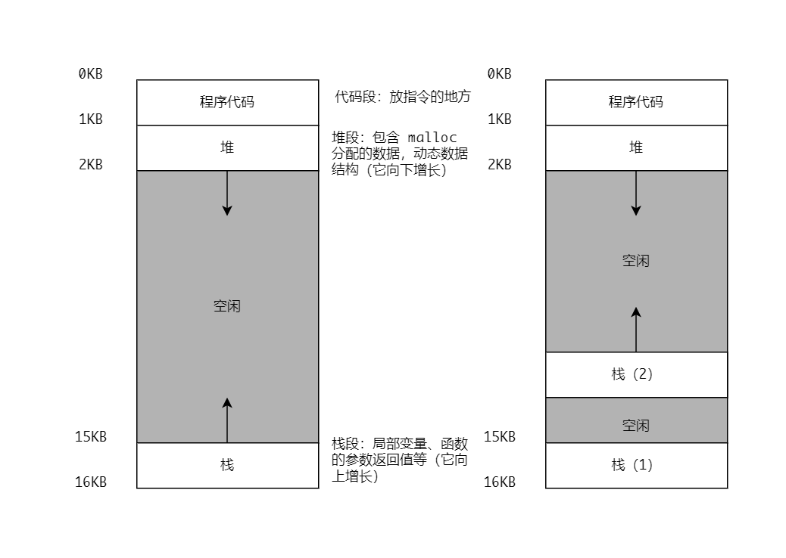

### 什么是线程
经典的观点是一个程序只有一个执行点（一个程序计数器，用来存放要执行的指令），但是多线程（multi-threaded）程序会有多个执行点（多个程序计数器，
每个都用于取指令和执行）。换一个角度看，每个线程都类似与独立的进程，只有一点区别：它们共享地址空间，从而能够访问相同的数据。

线程有自己的程序计数器，记录程序从哪里获取指令。每个线程有自己的一组用于计算的寄存器。如果有两个线程运行在一个处理器上，从一个线程（T1）切换到另一个线程（T2）时
必定发生上下文切换（context switch）。线程的上下文切换需要保存一个或多个线程控制块（Thread Control Block，TCB），从而保存每个线程的状态。但是与进程的上下文切换相比，
线程的上下文切换地址空间不变（即不需要切换当前使用的页表）。

当在进程中创建一个新的线程时，新的线程拥有自己的栈（因此也有自己的局部变量）、程序计数器（PC），但与它的创建者共享全局变量、文件描述符、信号处理函数和当前目录状态。
在单线程（进程）的地址空间模型中（左），只有一个栈，通常位于地址空间的底部。然而在多线程的进程中，每个线程都有一个栈，地址空间看起来会有不同（右）。

多个线程破坏了地址空间布局的美感，之前堆和栈可以互不影响地增长直到地址空间耗尽。多个栈就没这么简单了，不过通常栈不会很大（除了大量使用递归的程序）。

### 线程的优点和缺点

#### 优点
1. 一般而言线程之间的切换需要操作系统做的事情比进程间的切换少的多，因此多个线程对资源的需求要远小于多进程。

#### 缺点
1. 编写多线程的程序需要非常仔细。
2. 对多线程程序的调试要比对单线程程序的调试困难的多。
3. 有些时候更多的线程并不一定运行的更快（线程数一般应小于等于操作系统支持的并行线程数，因为过多的线程上下文切换所带来的损耗也会增加）。

### 线程的 API

#### 创建线程
```c
#include <pthread.h>

int pthread_create(pthread_t *thread, pthread_attr *attr, void *(*start_routine) (void *), void *arg);
```
第一个参数指向 pthread_t 类型数据的指针，线程被创建时，这个指针指向的变量中将被写入一个标识符，我们用该标识符来引用新线程。

第二个参数用于设置线程的属性，一般不需要特殊的属性，设置为 NULL 即可。

最后两个参数分别告诉线程将要启动执行的函数和传递给该函数的参数。

该函数调用成功将返回 0，失败将返回错误代码。

#### 终止线程
线程通过调用 pthread_exit 函数终止执行。这个函数的作用是，终止调用它的线程并返回一个指向某个对象的指针。

!!! warning "绝不能向 retval 传递一个指向局部变量的指针，因为线程调用该函数后，这个局部变量就不存在了，这将引起严重的程序漏洞。"
```c
#include <pthread.h>

void pthread_exit(void *retval);
```

#### 等待线程
pthread_join 将阻塞调用该函数的线程直到等待的目标线程运行完成。
```c
#include <stdio.h>

int pthread_join(pthread_t th, void **thread_return);
```
第一个参数指定了将要等待的线程。

第二个参数是一个指针，它指向另一个指针，而后者指向线程的返回值。

该函数成功调用将返回 0，失败时返回错误代码。

#### 代码示例
```c
// main.c
// 编译：# gcc main.c -pthread -o main
// 运行：# ./main
#include <stdio.h>
#include <unistd.h>
#include <stdlib.h>
#include <pthread.h>
#include <string.h>

void *thread_function(void *arg);

char message[] = "Hello world!";

int main() {
    int res;
    pthread_t a_thread;
    void *thread_result;

    res = pthread_create(&a_thread, NULL, thread_function, (void *) message);
    if(res != 0) {
        perror("Thread create failed!");
        exit(EXIT_FAILURE);
    }

    printf("Waiting for thread to finish...\n");
    res = pthread_join(a_thread, &thread_result);
    if(res != 0) {
        perror("Thread join failed!");
        exit(EXIT_FAILURE);
    }

    printf("Thread joined, it returned %s\n", (char *) thread_result);
    printf("Message is now %s\n", message);
    exit(EXIT_SUCCESS);
}

void *thread_function(void *arg) {
    printf("thread function is running. Argument was %s\n", (char *) arg);
    sleep(3);
    strcpy(message, "Bye!");
    pthread_exit("Thank you for CPU tune!");
}
```

### 多线程的带来的挑战
#### 不可控的线程调度。
一旦线程创建，可能会立即执行（取决于调度程序），或者处于就绪状态等待执行。例子中我们创建了两个线程，分别打印“A”或“B”。
```c
#include <stdio.h>
#include <assert.h>
#include <pthread.h>

void *thread_function(void *arg);

int main() {
    pthread_t a_thread, b_thread;
    int res;

    printf("main: begin\n");

    res = pthread_create(&a_thread, NULL, thread_function, "A");
    assert(res == 0);
    res = pthread_create(&b_thread, NULL, thread_function, "B");
    assert(res == 0);

    res = pthread_join(a_thread, NULL);
    assert(res == 0);
    res = pthread_join(b_thread, NULL);
    assert(res == 0);

    printf("main: end\n");
}

void *thread_function(void *arg) {
    printf("%s\n", (char *) arg);
    return NULL;
}
```
多次运行上面的程序会发现“A”和“B”输出的先后顺序并不是固定的，因为多线程导致我们很难说程序什么时候会运行了，并发使得程序变得复杂了。

#### 错误的共享数据——原子性的愿望。
接着我们演示一个简单的例子，两个线程希望更新一个全局变量。全局变量是一个计数器，两个线程分别将计数器的值增加 1000000。
```c
#include <stdio.h>
#include <assert.h>
#include <pthread.h>

void *thread_function(void *arg);

int volatile counter = 0;

int main() {
    pthread_t a_thread, b_thread;
    int res;

    printf("main: begin (counter = %d)\n", counter);

    res = pthread_create(&a_thread, NULL, thread_function, "A");
    assert(res == 0);
    res = pthread_create(&b_thread, NULL, thread_function, "B");
    assert(res == 0);

    res = pthread_join(a_thread, NULL);
    assert(res == 0);
    res = pthread_join(b_thread, NULL);
    assert(res == 0);

    printf("main: done with both (counter = %d)\n", counter);
}

void *thread_function(void *arg) {
    printf("%s begin\n", (char *)arg);

    for (int i = 0; i < 1000000; ++i) {
        counter = counter + 1;
    }

    printf("%s end\n", (char *) arg);

    return NULL;
}
```
通过运行代码，即使是在单处理器上多次运行，我们也会发现最终的结果大概率少于 2000000。
```text
main: begin (counter = 0)
A begin
B begin
A end
B end
main: done with both (counter = 1711917)
```
为了理解为什么发生这种情况，通过命令 `objdump -d main` 获得程序的汇编指令。我们只是想将 counter 加 1，完成这项功能所需要的指令看起来可能像下面这样，
最终通过三条汇编指令完成将 counter 加 1 的任务。
```assembly
0000000000401678 <thread_function>:
···
  40169d:       8b 05 8d 69 00 00       mov    0x698d(%rip),%eax        # 408030 <counter>
  4016a3:       83 c0 01                add    $0x1,%eax
  4016a6:       89 05 84 69 00 00       mov    %eax,0x6984(%rip)        # 408030 <counter>
···
```
这个例子假定，变量 counter 位于地址 0x698d。在这三条指令中，先用 mov 指令，从内存地址处取出值，放入 eax。然后给 eax 寄存器的值加 1（0x1）。
最后 eax 的值被存回内存中相同的地址。

假设两个线程之一（线程 A）进入这个代码区域，将 counter 的值（假设此时是 50）加载到寄存器 eax。因此线程 A 的 eax=50，然后向寄存器加 1，此时 eax = 51。
现在：时钟中断发生了。因此操作系统将当前正在运行的线程（它的程序计数器、寄存器，包括 eax 等）的状态保存到线程的 TCB。

接着糟糕的事情发生了，线程 B 被选中运行，并进入同一段代码。此时 counter 的值仍为 50，然后线程 B 顺利的将 counter 的值加 1。此时内存中 counter 的值
为 51。

最后又发生了一次上下文切换，线程 A 恢复运行。它已经执行了 mov 和 add 指令，因此接下来执行最后一条 mov 指令。因为上次上下文切换线程 A 的 eax 的值为 51，
因此在执行最后一条 move 指令时，counter 的值再次被设置为 51。可能更糟糕的情况是，在线程 A 重新获得调度时，线程 B 已经将 counter 的值增加了多次。

这里展示的情况称为**竞态条件**（race condition）：结果取决于代码的执行时间。

由于执行过程中发生了上下文切换，导致没有得到正确的结果。事实上每次执行都会得到不同的结果。因此我们称这个结果是**不确定的**（indeterminate）的而不是**确定的**(deterministic)。

由于执行这段代码的多个线程可能导致竞争状态，因此将这段代码称**为临界区**（critical section）。


解决这个问题的一种途径是有用更强大的指令，单步就能完成上述三条执行完成的事情。比如有这样一条指令：
```c
memory-add 0x698d 0x1
```
假设这条指令将一个值添加到内存位置，并且硬件保证它以原子方式（atomically）执行。当指令执行时，它会向期望的那样执行更新，并且保证中间不会中断。要么全部执行，
要么没有执行，而不会有中间状态。

但是一般情况下不会有这样的指令，设想我们要构建一个并发的集合，并希望更新它。我们会希望硬件指令提供“B 树的原子更新”指令码？至少理智的指令集不会提供这样的指令。

所以我们希望硬件能够提供一些有用的指令，可以在这些指令之上构建一个通用的集合，即所所谓的同步原语（synchronization primitive）。通过这些同步原语加上操作系统的
一些帮助（线程调度的接口），我们将能够构建多线程代码，以同步和受控的方式访问临界区，从而可靠地产生正确的结果——尽管并发很有挑战。

!!! note "同步原语"
    **临界区**：是访问共享资源的一段代码，资源通常是一个变量或数据结构。

    **竞态条件**：出现在多个执行线程大致同时进入临界区时，它们都试图更新共享的资源，导致了令人惊讶的结果。

    **互斥**：为了避免结果的不确定性，线程应该使用某种互斥（mutual exclusion）原语。这样可以保证只有一个线程进入临界区，从而避免出现竞态，并产生确定的输出。

#### 等待一个条件满足。
除了共享变量这一种线程之间的交互外，通常还有另一种交互，即线程在继续之前必须等待另一个线程完成某些操作。

pthread_join 就是这样的一种情况，需要等待另一个线程执行完成才能继续当前线程执行下去。

贴合应用的场景是生产者和消费者模型，当没有东西可以消费的时候消费者需要等待生产者生产，当生产过剩的时候生产者需要等待消费者消费。

### 并发编程的约束

### QA
1. Java 中线程栈空间默认的限制是多少？通过什么参数进行调节？

2. 为什么 pthread_join 函数第二个参数被定义为一个指向指针的指针？

    有两个原因导致 pthread_join 函数的第二个参数被定义为一个指向指针的指针。

    - 第一个原因是这个指针指向我们希望另一个线程的返回值，因为另一个函数可以返回任何东西，所以它被定义为一个指向 void 的指针。

    - 第二个原因是 pthread_join 函数改变了传入参数的值，所以需要一个指向该值（指向 void 的指针）的指针。

    错误的实现方式在方法内部改变形参的指向并没有影响到实参。正确的实现方式是将参数定义为指针的指针，然后再将指向实参的指针传递给函数，最终将实参指向正确的结果。
    ```c
    void *thread_result = NULL;
   
    // 错误的实现方式
    res = pthread_join(a_thread, thread_result);
    int pthread_join(Thread thread, void *result) {
        a_type a = a_typet(); // 模拟另一个线程的返回结果
        result = &a; // 方法结束时 thread_result 没有获得想要的结果，并未指向 a
        // 最终的结果是 result 指针指向 a，thread_result 指针指向 NULL
    }
   
    // 正确的实现方式
    res = pthread_join(a_thread, &thread_result);
    int pthread_join(Thread thread, void **result) {
        a_type a = a_typet(); // 模拟另一个线程的返回结果
        *result = &a; // 方法结束时 thread_result 获得想要的结果，即指向 a
        // 最终的结果是 result 指针指向 thread_result 指针，thread_result 指针指向 a
    }
    ```

3. 什么是 POSIX 线程库？